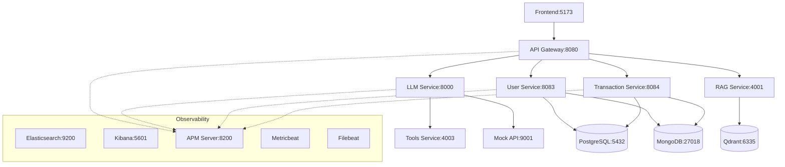
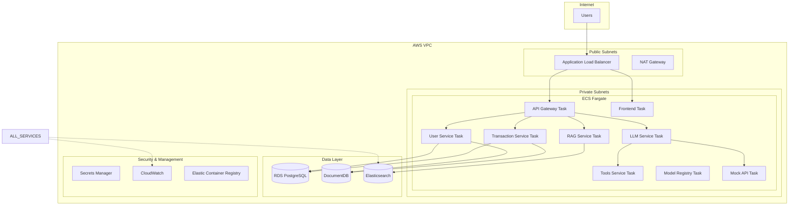

# 🏗️ Crash-Pay Services & Infrastructure Documentation

## Table of Contents
- [Services Overview](#services-overview)
- [Infrastructure Overview](#infrastructure-overview)
- [Service Details](#service-details)
- [Infrastructure Details](#infrastructure-details)
- [Network Architecture](#network-architecture)
- [Security Considerations](#security-considerations)

---

## Services Overview

The Crash-Pay application consists of **9 core microservices** designed with intentional vulnerabilities for security research and OWASP-LLM testing:

| Service | Port | Tech Stack | Primary Purpose | OWASP-LLM Vulnerabilities |
|---------|------|------------|-----------------|---------------------------|
| **API Gateway** | 8080 | Node.js/Express | Authentication, routing, rate limiting | LLM01, LLM04 |
| **LLM Service** | 8000 | FastAPI/LangChain | Multi-provider LLM integration | LLM10 (plain-text API keys) |
| **User Service** | 8083 | Node.js/Sequelize | User management, authentication | Over-privileged agent writes |
| **Transaction Service** | 8084 | Node.js/Sequelize | Banking operations, transfers | Over-privileged agent writes |
| **Tools Service** | 4003 | FastAPI | Shell execution, payment processing | LLM07, LLM08 |
| **RAG Service** | 4001 | FastAPI | Document retrieval (unauthenticated) | LLM06 (info disclosure) |
| **Model Registry** | 8050 | Go/Python | Model storage & serving | LLM05, LLM10 |
| **Model Retrain** | - | Python | Auto fine-tuning from training drops | LLM03 (poisoning) |
| **Mock External API** | 9001 | Node.js | Fake bank partner simulation | LLM08 (excessive agency) |

### Data Stores
| Store | Port | Purpose | Technology |
|-------|------|---------|------------|
| **PostgreSQL** | 5432 | User & transaction data | PostgreSQL 15 |
| **MongoDB** | 27018 | Application logs | MongoDB 7.0 |
| **Qdrant** | 6335 | Vector embeddings | Qdrant |

### Frontend
| Component | Port | Purpose | Technology |
|-----------|------|---------|------------|
| **React Frontend** | 5173 | Web interface | React 18 + Vite |

---

## Infrastructure Overview

### Local Development (Docker Compose)
- **Business Network**: `crash-pay-business` - Service-to-service communication
- **Observability Network**: `crash-pay-observability` - APM and monitoring
- **Single Configuration**: Unified `docker-compose.yml` with all services

### AWS Production (Terraform)
- **Compute**: ECS Fargate tasks with auto-scaling
- **Networking**: VPC with public/private subnets, ALB
- **Storage**: RDS PostgreSQL, DocumentDB (MongoDB), Elasticsearch
- **Security**: IAM roles, Secrets Manager, security groups
- **Monitoring**: CloudWatch, Elasticsearch logging

---

# Service Details

## 🚪 API Gateway
**Port**: 8080 | **Tech**: Node.js + Express

### Purpose
Central entry point for all client requests with JWT authentication and service routing.

### Key Features
- JWT token validation
- Service discovery and routing
- CORS middleware (intentionally permissive)
- Request/response logging
- APM instrumentation

### Endpoints
```
GET  /health          - Health check
POST /auth/login      - User authentication
POST /auth/register   - User registration
GET  /api/users/*     - Proxy to User Service
GET  /api/transactions/* - Proxy to Transaction Service
POST /api/chat        - Proxy to LLM Service
GET  /api/search      - Proxy to RAG Service
```

### Intentional Vulnerabilities
- **LLM01**: No input sanitization for chat prompts
- **LLM04**: Missing rate limiting allows DoS attacks
- Overly permissive CORS policy
- JWT secrets potentially exposed in logs

### Configuration
```javascript
const config = {
  port: process.env.PORT || 8080,
  jwtSecret: process.env.JWT_SECRET,
  services: {
    userService: 'http://user-service:8083',
    transactionService: 'http://transaction-service:8084',
    llmService: 'http://llm-service:8000',
    ragService: 'http://rag-service:4001'
  }
}
```

---

## 🤖 LLM Service
**Port**: 8000 | **Tech**: FastAPI + LangChain

### Purpose
Multi-provider LLM integration with support for OpenAI, Anthropic, Cohere, Google, Azure, and local models.

### Key Features
- **14+ LLM Providers**: OpenAI, Anthropic, Cohere, Google, Azure, Mistral, etc.
- **Dynamic Model Switching**: Runtime provider/model switching
- **Function Calling**: Banking operations, shell commands, payments
- **RAG Integration**: Vector search augmentation
- **Assistant API**: Thread-based conversations
- **Streaming Support**: Real-time response streaming

### Supported Providers & Models
```yaml
OpenAI:
  - gpt-4o, gpt-4o-mini, gpt-4-turbo, gpt-3.5-turbo
  - o1-preview, o1-mini (reasoning models)

Anthropic:
  - claude-3-5-sonnet, claude-3-opus, claude-3-haiku

Google:
  - gemini-1.5-pro, gemini-1.5-flash, gemma-2

Cohere:
  - command-r-plus, command-r, command-light

Azure OpenAI:
  - Custom deployments with Azure endpoints

Local Models:
  - Ollama integration for on-premise models
```

### Banking Functions
The LLM has access to dangerous banking operations:
```python
# Available Tools
- check_account_balance(account_type)
- transfer_money(amount, recipient, source_account)
- shell_execution(command)  # Direct OS access
- payment_processing(payload)  # External payment API
```

### Intentional Vulnerabilities
- **LLM10**: API keys stored in plain text environment variables
- **LLM07**: Over-reliance on LLM for critical payment decisions
- **LLM08**: Excessive agency with shell and payment access
- No function call validation or approval workflow
- Function results directly returned to users

### Critical Endpoints
```python
POST /chat                    # Main chat interface
POST /switch-provider         # Runtime provider switching
POST /assistant/message       # Assistant API conversations
GET  /logs/recent            # Exposes API call logs
POST /test-model             # Model connectivity testing
```

---

## 👥 User Service
**Port**: 8083 | **Tech**: Node.js + Sequelize

### Purpose
User account management with PostgreSQL backend.

### Key Features
- User registration and authentication
- Profile management
- Account status tracking
- Database migrations
- APM instrumentation

### Database Schema
```sql
Users Table:
- id (UUID primary key)
- email (unique)
- password_hash (bcrypt)
- first_name, last_name
- account_status (active/suspended/closed)
- created_at, updated_at
- last_login
```

### Endpoints
```
POST /register     - Create new user account
POST /login        - Authenticate user
GET  /profile      - Get user profile
PUT  /profile      - Update user profile
GET  /health       - Service health check
```

### Security Issues
- Password policies not enforced
- User enumeration possible via error messages
- PII exposed in logs and error responses

---

## 💰 Transaction Service
**Port**: 8084 | **Tech**: Node.js + Sequelize

### Purpose
Banking transaction processing with PostgreSQL backend.

### Key Features
- Account balance management
- Money transfers between accounts
- Transaction history
- Transaction validation
- APM instrumentation

### Database Schema
```sql
Accounts Table:
- id (UUID primary key)
- user_id (foreign key)
- account_type (checking/savings)
- balance (decimal)
- account_number (unique)

Transactions Table:
- id (UUID primary key)
- from_account_id, to_account_id
- amount (decimal)
- transaction_type (transfer/deposit/withdrawal)
- status (pending/completed/failed)
- created_at
```

### Endpoints
```
GET  /accounts         - List user accounts
POST /accounts         - Create new account
GET  /accounts/:id     - Get account details
POST /transfer         - Execute money transfer
GET  /transactions     - Transaction history
GET  /health          - Service health check
```

### Security Issues
- Missing transaction limits
- No fraud detection
- Race conditions in concurrent transfers
- Insufficient authorization checks

---

## 🔧 Tools Service
**Port**: 4003 | **Tech**: FastAPI

### Purpose
**EXTREMELY DANGEROUS** - Direct shell execution and payment processing for LLM agents.

### Key Features
- **Shell Command Execution**: Direct OS command execution
- **Payment Processing**: External payment API integration
- **No Authentication**: Completely open endpoints
- **No Validation**: Commands executed without sanitization

### Critical Endpoints
```python
GET  /shell?cmd={command}     # Direct shell execution
POST /payments               # Process real payments
GET  /health                # Health check
```

### Shell Execution Example
```bash
# Accessible via:
curl "http://tools-service:4003/shell?cmd=whoami"
curl "http://tools-service:4003/shell?cmd=ls -la /"
curl "http://tools-service:4003/shell?cmd=cat /etc/passwd"
```

### Payment Processing Example
```bash
curl -X POST http://tools-service:4003/payments \
  -H "Content-Type: application/json" \
  -d '{"from_account":"123","to_account":"456","amount":1000}'
```

### Intentional Vulnerabilities
- **LLM07**: Payments processed based on LLM recommendations
- **LLM08**: Excessive agency with shell and payment access
- **Command Injection**: No input sanitization
- **Privilege Escalation**: Runs with container privileges
- **Financial Risk**: Real payment processing without approval

---

## 📚 RAG Service
**Port**: 4001 | **Tech**: FastAPI

### Purpose
Retrieval-Augmented Generation with intentionally exposed sensitive documents.

### Key Features
- Vector similarity search
- Document embedding storage
- **No Authentication**: Open access to all documents
- FAISS vector database integration

### Document Corpus
Located in `docs/rag_corpus/` with intentionally sensitive content:
```
├── financial_policies.md       # Bank policies
├── customer_data.csv          # PII data
├── confidential.md           # Trade secrets
├── compliance_reports.pdf    # Regulatory data
└── internal_procedures.md    # Security procedures
```

### Endpoints
```python
POST /search         # Vector similarity search
GET  /documents      # List all documents
GET  /health        # Health check
POST /reindex       # Rebuild vector index
```

### Intentional Vulnerabilities
- **LLM06**: Sensitive information disclosure
- No access controls or authentication
- PII and confidential data exposed
- No audit logging of data access

---

## 📦 Model Registry
**Port**: 8050 | **Tech**: Go/Python

### Purpose
Model storage and serving with unsigned model files.

### Key Features
- Model file storage and serving
- **No Signature Verification**: Models served without validation
- Version management
- Download endpoint for model files

### Intentional Vulnerabilities
- **LLM05**: Supply chain attacks via unsigned models
- **LLM10**: Model integrity not verified
- Potential for malicious model injection

---

## 🔄 Model Retrain Service
**Tech**: Python Background Process

### Purpose
Automatic model fine-tuning from training data drops.

### Key Features
- Watches `training-drops/` directory
- Automatic fine-tuning trigger
- **No Data Validation**: Training data used without verification

### Intentional Vulnerabilities
- **LLM03**: Training data poisoning attacks
- No data validation or sanitization
- Automatic model updates without approval

---

## 🌐 Mock External API
**Port**: 9001 | **Tech**: Node.js

### Purpose
Simulates external banking partner API.

### Key Features
- Fake account verification
- Mock payment processing
- **HTTP Only**: No TLS encryption
- Predictable responses

### Intentional Vulnerabilities
- **LLM08**: Excessive agency trust
- Unencrypted communication
- No authentication between services

---

# Infrastructure Details

## 🐳 Local Development (Docker Compose)

### Network Architecture
```yaml
Networks:
  crash-pay-business:
    driver: bridge
    # Service-to-service communication
    
  crash-pay-observability:
    driver: bridge
    # APM and monitoring data flow
```

### Service Dependencies


### Volume Mounts
```yaml
Persistent Data:
  - postgres_data:/var/lib/postgresql/data
  - mongodb_data:/data/db
  - qdrant_data:/qdrant/storage
  - elasticsearch_data:/usr/share/elasticsearch/data

Configuration:
  - ./docs/rag_corpus:/app/docs:ro
  - ./training-drops:/app/training-drops
  - ./shared/auth:/app/shared/auth:ro
```

---

## ☁️ AWS Production (Terraform)

### High-Level Architecture


### Terraform Modules

#### `main.tf` - Core Configuration
```hcl
# Provider configuration
terraform {
  required_providers {
    aws = {
      source  = "hashicorp/aws"
      version = "~> 5.0"
    }
  }
}

# Variables and locals
variable "environment" {
  description = "Environment name"
  type        = string
  default     = "dev"
}

variable "project_name" {
  description = "Project name"
  type        = string
  default     = "crash-pay"
}
```

#### `vpc.tf` - Network Infrastructure
```hcl
# VPC with public/private subnets
resource "aws_vpc" "main" {
  cidr_block           = "10.0.0.0/16"
  enable_dns_hostnames = true
  enable_dns_support   = true
  
  tags = {
    Name = "${var.project_name}-vpc"
    Environment = var.environment
  }
}

# Public subnets for ALB
resource "aws_subnet" "public" {
  count = 2
  
  vpc_id                  = aws_vpc.main.id
  cidr_block              = "10.0.${count.index + 1}.0/24"
  availability_zone       = data.aws_availability_zones.available.names[count.index]
  map_public_ip_on_launch = true
}

# Private subnets for ECS tasks
resource "aws_subnet" "private" {
  count = 2
  
  vpc_id            = aws_vpc.main.id
  cidr_block        = "10.0.${count.index + 10}.0/24"
  availability_zone = data.aws_availability_zones.available.names[count.index]
}
```

#### `alb.tf` - Load Balancer
```hcl
# Application Load Balancer
resource "aws_lb" "main" {
  name               = "${var.project_name}-alb"
  internal           = false
  load_balancer_type = "application"
  security_groups    = [aws_security_group.alb.id]
  subnets            = aws_subnet.public[*].id
  
  enable_deletion_protection = false
}

# Target groups for each service
resource "aws_lb_target_group" "services" {
  for_each = var.services
  
  name     = "${var.project_name}-${each.key}"
  port     = each.value.port
  protocol = "HTTP"
  vpc_id   = aws_vpc.main.id
  
  health_check {
    enabled             = true
    healthy_threshold   = 2
    path                = each.value.health_path
    protocol            = "HTTP"
    unhealthy_threshold = 2
  }
}
```

#### `ecs.tf` - Container Orchestration
```hcl
# ECS Cluster
resource "aws_ecs_cluster" "main" {
  name = "${var.project_name}-cluster"
  
  setting {
    name  = "containerInsights"
    value = "enabled"
  }
}

# ECS Task Definitions
resource "aws_ecs_task_definition" "services" {
  for_each = var.services
  
  family                   = "${var.project_name}-${each.key}"
  network_mode             = "awsvpc"
  requires_compatibilities = ["FARGATE"]
  cpu                      = each.value.cpu
  memory                   = each.value.memory
  execution_role_arn       = aws_iam_role.ecs_execution_role.arn
  task_role_arn           = aws_iam_role.ecs_task_role.arn
  
  container_definitions = templatefile(
    "ecs-task-defs/${each.key}.json",
    {
      aws_region = var.aws_region
      service_name = each.key
      image_uri = "${aws_ecr_repository.services[each.key].repository_url}:latest"
      elasticsearch_endpoint = aws_elasticsearch_domain.main.endpoint
      rds_endpoint = aws_db_instance.main.endpoint
      docdb_endpoint = aws_docdb_cluster.main.endpoint
    }
  )
}

# ECS Services
resource "aws_ecs_service" "services" {
  for_each = var.services
  
  name            = "${var.project_name}-${each.key}"
  cluster         = aws_ecs_cluster.main.id
  task_definition = aws_ecs_task_definition.services[each.key].arn
  desired_count   = each.value.desired_count
  launch_type     = "FARGATE"
  
  network_configuration {
    security_groups  = [aws_security_group.ecs_tasks.id]
    subnets         = aws_subnet.private[*].id
    assign_public_ip = false
  }
  
  load_balancer {
    target_group_arn = aws_lb_target_group.services[each.key].arn
    container_name   = each.key
    container_port   = each.value.port
  }
  
  depends_on = [aws_lb_listener.main]
}
```

#### `rds.tf` - PostgreSQL Database
```hcl
# RDS PostgreSQL Instance
resource "aws_db_instance" "main" {
  identifier             = "${var.project_name}-postgres"
  allocated_storage      = 20
  max_allocated_storage  = 100
  storage_type          = "gp2"
  engine                = "postgres"
  engine_version        = "15.4"
  instance_class        = "db.t3.micro"
  
  db_name  = "crashpay"
  username = var.db_username
  password = var.db_password
  
  vpc_security_group_ids = [aws_security_group.rds.id]
  db_subnet_group_name   = aws_db_subnet_group.main.name
  
  backup_retention_period = 7
  backup_window          = "03:00-04:00"
  maintenance_window     = "sun:04:00-sun:05:00"
  
  skip_final_snapshot = true
  deletion_protection = false
  
  tags = {
    Name = "${var.project_name}-postgres"
    Environment = var.environment
  }
}

# DB Subnet Group
resource "aws_db_subnet_group" "main" {
  name       = "${var.project_name}-db-subnet-group"
  subnet_ids = aws_subnet.private[*].id
  
  tags = {
    Name = "${var.project_name}-db-subnet-group"
  }
}
```

#### `docdb.tf` - MongoDB (DocumentDB)
```hcl
# DocumentDB Cluster
resource "aws_docdb_cluster" "main" {
  cluster_identifier      = "${var.project_name}-docdb"
  engine                 = "docdb"
  master_username        = var.docdb_username
  master_password        = var.docdb_password
  backup_retention_period = 7
  preferred_backup_window = "03:00-04:00"
  skip_final_snapshot    = true
  
  vpc_security_group_ids = [aws_security_group.docdb.id]
  db_subnet_group_name   = aws_docdb_subnet_group.main.name
  
  tags = {
    Name = "${var.project_name}-docdb"
    Environment = var.environment
  }
}

# DocumentDB Instances
resource "aws_docdb_cluster_instance" "main" {
  count              = 1
  identifier         = "${var.project_name}-docdb-${count.index}"
  cluster_identifier = aws_docdb_cluster.main.id
  instance_class     = "db.t3.medium"
}
```

#### `elasticsearch.tf` - Logging & Search
```hcl
# Elasticsearch Domain
resource "aws_elasticsearch_domain" "main" {
  domain_name           = "${var.project_name}-elasticsearch"
  elasticsearch_version = "7.10"
  
  cluster_config {
    instance_type = "t3.small.elasticsearch"
    instance_count = 1
  }
  
  ebs_options {
    ebs_enabled = true
    volume_type = "gp2"
    volume_size = 20
  }
  
  vpc_options {
    security_group_ids = [aws_security_group.elasticsearch.id]
    subnet_ids         = [aws_subnet.private[0].id]
  }
  
  access_policies = jsonencode({
    Version = "2012-10-17"
    Statement = [
      {
        Action = "es:*"
        Principal = "*"
        Effect = "Allow"
        Resource = "arn:aws:es:${var.aws_region}:${data.aws_caller_identity.current.account_id}:domain/${var.project_name}-elasticsearch/*"
      }
    ]
  })
  
  tags = {
    Domain = "${var.project_name}-elasticsearch"
    Environment = var.environment
  }
}
```

#### `secrets.tf` - Secrets Manager
```hcl
# Database Credentials
resource "aws_secretsmanager_secret" "db_credentials" {
  name = "${var.project_name}/database/credentials"
}

resource "aws_secretsmanager_secret_version" "db_credentials" {
  secret_id = aws_secretsmanager_secret.db_credentials.id
  secret_string = jsonencode({
    username = var.db_username
    password = var.db_password
    host     = aws_db_instance.main.endpoint
    port     = aws_db_instance.main.port
    dbname   = aws_db_instance.main.db_name
  })
}

# LLM API Keys
resource "aws_secretsmanager_secret" "llm_keys" {
  name = "${var.project_name}/llm/api-keys"
}

resource "aws_secretsmanager_secret_version" "llm_keys" {
  secret_id = aws_secretsmanager_secret.llm_keys.id
  secret_string = jsonencode({
    openai_api_key     = var.openai_api_key
    anthropic_api_key  = var.anthropic_api_key
    google_api_key     = var.google_api_key
    cohere_api_key     = var.cohere_api_key
  })
}

# Elasticsearch Credentials
resource "aws_secretsmanager_secret" "elasticsearch_credentials" {
  name = "${var.project_name}/elasticsearch/credentials"
}

resource "aws_secretsmanager_secret_version" "elasticsearch_credentials" {
  secret_id = aws_secretsmanager_secret.elasticsearch_credentials.id
  secret_string = jsonencode({
    username = "elastic"
    password = random_password.elasticsearch_password.result
    endpoint = aws_elasticsearch_domain.main.endpoint
  })
}
```

#### `iam.tf` - Identity & Access Management
```hcl
# ECS Execution Role
resource "aws_iam_role" "ecs_execution_role" {
  name = "${var.project_name}-ecs-execution-role"
  
  assume_role_policy = jsonencode({
    Version = "2012-10-17"
    Statement = [
      {
        Action = "sts:AssumeRole"
        Effect = "Allow"
        Principal = {
          Service = "ecs-tasks.amazonaws.com"
        }
      }
    ]
  })
}

# ECS Task Role
resource "aws_iam_role" "ecs_task_role" {
  name = "${var.project_name}-ecs-task-role"
  
  assume_role_policy = jsonencode({
    Version = "2012-10-17"
    Statement = [
      {
        Action = "sts:AssumeRole"
        Effect = "Allow"
        Principal = {
          Service = "ecs-tasks.amazonaws.com"
        }
      }
    ]
  })
}

# Policies
resource "aws_iam_role_policy_attachment" "ecs_execution_role_policy" {
  role       = aws_iam_role.ecs_execution_role.name
  policy_arn = "arn:aws:iam::aws:policy/service-role/AmazonECSTaskExecutionRolePolicy"
}

resource "aws_iam_role_policy" "ecs_task_secrets" {
  name = "${var.project_name}-ecs-task-secrets"
  role = aws_iam_role.ecs_task_role.id
  
  policy = jsonencode({
    Version = "2012-10-17"
    Statement = [
      {
        Effect = "Allow"
        Action = [
          "secretsmanager:GetSecretValue"
        ]
        Resource = [
          aws_secretsmanager_secret.db_credentials.arn,
          aws_secretsmanager_secret.llm_keys.arn,
          aws_secretsmanager_secret.elasticsearch_credentials.arn
        ]
      }
    ]
  })
}
```

### ECS Task Definitions

Each service has a dedicated task definition in `infra/aws/ecs-task-defs/`:

#### `api-gateway.json`
```json
[
  {
    "name": "api-gateway",
    "image": "${image_uri}",
    "portMappings": [
      {
        "containerPort": 8080,
        "protocol": "tcp"
      }
    ],
    "environment": [
      {
        "name": "NODE_ENV",
        "value": "production"
      },
      {
        "name": "AWS_ELASTICSEARCH_ENDPOINT",
        "value": "${elasticsearch_endpoint}"
      }
    ],
    "secrets": [
      {
        "name": "JWT_SECRET",
        "valueFrom": "arn:aws:secretsmanager:${aws_region}:${account_id}:secret:${project_name}/api-gateway/jwt-secret"
      }
    ],
    "logConfiguration": {
      "logDriver": "awslogs",
      "options": {
        "awslogs-group": "/ecs/${service_name}",
        "awslogs-region": "${aws_region}",
        "awslogs-stream-prefix": "ecs"
      }
    },
    "healthCheck": {
      "command": [
        "CMD-SHELL",
        "curl -f http://localhost:8080/health || exit 1"
      ],
      "interval": 30,
      "timeout": 5,
      "retries": 3
    }
  }
]
```

---

## 🌐 Network Architecture

### Local Development Flow
```
[Frontend:5173] 
    ↓ HTTP
[API Gateway:8080]
    ↓ Internal Network
[User Service:8083] → [PostgreSQL:5432]
[Transaction Service:8084] → [PostgreSQL:5432]
[LLM Service:8000] → [Tools Service:4003]
[RAG Service:4001] → [Qdrant:6335]
    ↓ Observability Network
[Elasticsearch:9200] ← [APM Server:8200] ← [All Services]
[Kibana:5601] → [Elasticsearch:9200]
```

### AWS Production Flow
```
[Internet]
    ↓ HTTPS
[ALB:443] → [WAF] → [Security Groups]
    ↓ HTTP (Private Network)
[ECS Fargate Tasks] → [Target Groups]
    ↓ Private Subnets
[RDS:5432] [DocumentDB:27017] [Elasticsearch:443]
    ↓ Monitoring
[CloudWatch] [X-Ray] [ECS Container Insights]
```

### Security Groups Configuration
```hcl
# ALB Security Group
resource "aws_security_group" "alb" {
  name_prefix = "${var.project_name}-alb-"
  vpc_id      = aws_vpc.main.id
  
  ingress {
    from_port   = 80
    to_port     = 80
    protocol    = "tcp"
    cidr_blocks = ["0.0.0.0/0"]
  }
  
  ingress {
    from_port   = 443
    to_port     = 443
    protocol    = "tcp"
    cidr_blocks = ["0.0.0.0/0"]
  }
  
  egress {
    from_port   = 0
    to_port     = 0
    protocol    = "-1"
    cidr_blocks = ["0.0.0.0/0"]
  }
}

# ECS Tasks Security Group
resource "aws_security_group" "ecs_tasks" {
  name_prefix = "${var.project_name}-ecs-tasks-"
  vpc_id      = aws_vpc.main.id
  
  ingress {
    from_port       = 0
    to_port         = 65535
    protocol        = "tcp"
    security_groups = [aws_security_group.alb.id]
  }
  
  egress {
    from_port   = 0
    to_port     = 0
    protocol    = "-1"
    cidr_blocks = ["0.0.0.0/0"]
  }
}
```

---

## 🔒 Security Considerations

### Intentional Vulnerabilities (By Design)
These vulnerabilities are **intentionally implemented** for security research:

1. **Authentication Bypass**
   - Tools Service has no authentication
   - RAG Service exposes sensitive documents
   - Mock External API accepts any requests

2. **Injection Attacks**
   - Shell command injection in Tools Service
   - SQL injection potential in database queries
   - Prompt injection in LLM Service

3. **Data Exposure**
   - API keys in plain text environment variables
   - PII in logs and error messages
   - Sensitive documents in RAG corpus

4. **Insufficient Authorization**
   - Over-privileged service accounts
   - Missing function call approvals
   - Direct database access from services

### Production Security Recommendations
For actual production use, implement:

1. **Authentication & Authorization**
   ```bash
   # Add OAuth 2.0 / JWT validation
   # Implement RBAC (Role-Based Access Control)
   # Use API Gateway authentication
   ```

2. **Secrets Management**
   ```bash
   # Use AWS Secrets Manager / HashiCorp Vault
   # Rotate credentials regularly
   # Encrypt secrets at rest and in transit
   ```

3. **Network Security**
   ```bash
   # Enable WAF (Web Application Firewall)
   # Use private subnets for all services
   # Implement VPC endpoints for AWS services
   ```

4. **Input Validation**
   ```bash
   # Sanitize all user inputs
   # Implement rate limiting
   # Add content filtering for LLM inputs
   ```

5. **Monitoring & Alerting**
   ```bash
   # Enable detailed CloudWatch monitoring
   # Set up security alerts for anomalous behavior
   # Implement audit logging for all operations
   ```

### Observability Stack Security
The observability stack itself has intentional weaknesses:

- **No Authentication**: Elasticsearch, Kibana accessible without auth
- **Admin Dashboards**: Full system visibility without authorization
- **Log Exposure**: Sensitive data potentially logged
- **Metrics Exposure**: Performance data available to attackers

---

## 📊 Monitoring & Observability

### Elasticsearch Stack Components
| Component | Port | Purpose | Technology |
|-----------|------|---------|------------|
| **Elasticsearch** | 9200 | Log storage & search | Elasticsearch 7.10 |
| **Kibana** | 5601 | Visualization & APM UI | Kibana 7.10 |
| **APM Server** | 8200 | Application performance monitoring | Elastic APM 7.10 |
| **Metricbeat** | - | System & container metrics | Metricbeat 7.10 |
| **Filebeat** | - | Log collection & forwarding | Filebeat 7.10 |

### APM Integration
All services include APM instrumentation:
```javascript
// Node.js Services
const apm = require('elastic-apm-node').start({
  serviceName: process.env.ELASTIC_APM_SERVICE_NAME,
  serverUrl: process.env.ELASTIC_APM_SERVER_URL,
  environment: process.env.ELASTIC_APM_ENVIRONMENT
})

// Python Services
import elasticapm
from elasticapm.contrib.fastapi import make_apm_client, ElasticAPM

apm_client = make_apm_client({
  'SERVICE_NAME': 'llm-service',
  'SERVER_URL': 'http://apm-server:8200',
  'ENVIRONMENT': 'development'
})
```

### Key Metrics Tracked
- **Request Latency**: P50, P95, P99 response times
- **Error Rates**: HTTP 4xx/5xx error percentages
- **Throughput**: Requests per second by service
- **LLM Metrics**: Token usage, provider response times
- **Security Events**: Failed logins, suspicious commands
- **Resource Usage**: CPU, memory, disk utilization

### Dashboards Available
1. **Service Health**: Overall system status
2. **LLM Operations**: Provider performance and usage
3. **Security Events**: Authentication failures, suspicious activity
4. **Infrastructure**: Resource utilization and capacity
5. **Business Metrics**: Transaction volumes, user activity

---

This completes the comprehensive Services & Infrastructure documentation for the Crash-Pay application. The system is intentionally vulnerable and should only be used in isolated, secure environments for security research and training purposes. 