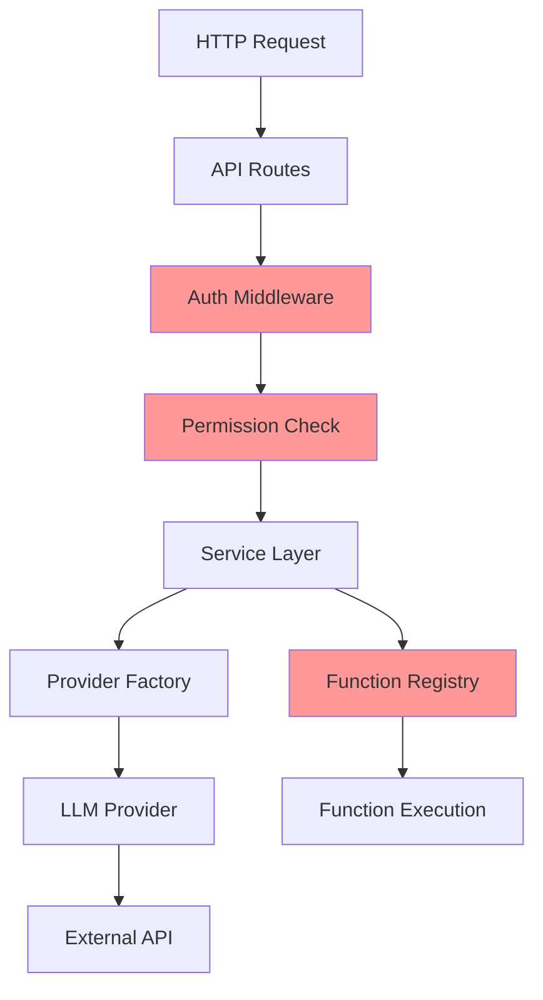

# 🏦 App Directory - Crash Pay Fake Bank LLM Service

## 📋 Architecture Overview

The `app/` directory contains the core application code organized into modular components. This architecture supports **red teaming scenarios** with clear security boundaries and attack surfaces.

```
app/
├── api/               # 🌐 HTTP API endpoints and routing
├── auth/              # 🔐 Authentication & authorization system  
├── config/            # ⚙️  Configuration management
├── models/            # 📄 Pydantic data models
├── providers/         # 🤖 LLM provider implementations
├── services/          # 🔧 Business logic layer
├── utils/             # 🛠️ Shared utilities
└── main.py           # 🚀 FastAPI application entry point
```

## 🎯 **Red Teaming Perspective**

### **Attack Surfaces**
1. **API Layer** (`api/`) - HTTP endpoint vulnerabilities, input validation
2. **Authentication** (`auth/`) - Token manipulation, privilege escalation
3. **Function Calling** (`services/`) - Function injection, unauthorized calls
4. **Provider Integration** (`providers/`) - API key exposure, prompt injection

### **Security Boundaries**
- **JWT Middleware** → **Permission System** → **Function Registry**
- **Provider Factory** → **Connection Modes** → **External APIs**
- **Service Layer** → **Business Logic** → **Function Execution**

## 📁 **Component Documentation**

| Component | Purpose | Security Role | Documentation |
|-----------|---------|---------------|---------------|
| [`api/`](./api/README.md) | HTTP endpoints, request handling | Entry point validation | [📖 API Docs](./api/README.md) |
| [`auth/`](./auth/README.md) | JWT validation, permissions | Access control enforcement | [🔐 Auth Docs](./auth/README.md) |
| [`config/`](./config/README.md) | Settings, model registry | Configuration security | [⚙️ Config Docs](./config/README.md) |
| [`models/`](./models/README.md) | Request/response schemas | Input validation | [📄 Models Docs](./models/README.md) |
| [`providers/`](./providers/README.md) | LLM integrations | External API security | [🤖 Providers Docs](./providers/README.md) |
| [`services/`](./services/README.md) | Business logic | Function call security | [🔧 Services Docs](./services/README.md) |
| [`utils/`](./utils/README.md) | Shared utilities | Logging, security helpers | [🛠️ Utils Docs](./utils/README.md) |

## 🔄 **Data Flow**



## 🛡️ **Security Architecture**

### **Defense Layers**
1. **Input Validation** (API + Models)
2. **Authentication** (JWT Middleware)
3. **Authorization** (Permission System)
4. **Function Security** (Registry + Execution)
5. **Output Filtering** (Response Processing)

### **Trust Boundaries**
- **External** ↔ **API Layer** (Untrusted → Validated)
- **API Layer** ↔ **Auth System** (Validated → Authenticated)
- **Auth System** ↔ **Service Layer** (Authenticated → Authorized)
- **Service Layer** ↔ **Providers** (Authorized → Executed)

## 🎯 **Key Integration Points**

### **Authentication Flow**
```python
api/routes/ → auth/middleware.py → auth/permissions.py → services/
```

### **LLM Request Flow**
```python
api/routes/ → services/llm_service.py → providers/factory.py → providers/[provider].py
```

### **Function Calling Flow**
```python
services/ → auth/permissions.py → api/routes/auth_chat.py → function execution
```

## 🔧 **Development Guidelines**

### **Adding New Components**
1. Follow the established folder structure
2. Add appropriate documentation (README.md)
3. Include security considerations
4. Update this main README

### **Security Considerations**
- Always validate inputs at the API layer
- Enforce permissions at the service layer
- Log security events appropriately
- Handle errors without information leakage

### **Testing Strategy**
- Unit tests for individual components
- Integration tests for component interactions
- Security tests for attack vectors
- Red teaming scenarios for realistic attacks

---

**Each folder contains detailed documentation about its specific responsibilities, security considerations, and usage patterns.** 